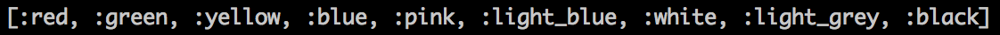
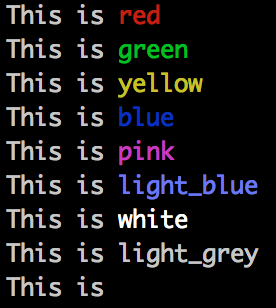

# colorizr
colorizr is a Ruby gem that provides an easy way to add color to your command line output by extending the `String` class.

## Features Overview
* Methods to alter the color of any string (when it is output to the terminal)
  * `red`
  * `green`
  * `yellow`
  * `blue`
  * `pink`
  * `light_blue`
  * `white`
  * `light_grey`
  * `black`
* Additional `String` class methods
  * `String.colors` - returns an array of all the color options
  * `String.sample_colors` - prints sample output demonstrating all the colors

## Usage Instructions
```
require 'colorizr'

puts 'John'.red
puts 'Paul'.green
puts 'George'.blue
puts 'Ringo'.yellow
```


```
p String.colors
```


```
String.sample_colors
```


## Installation Instructions
1. Download [colorizr-0.0.1.gem](colorizr-0.0.1.gem)
2. `gem install colorizr`